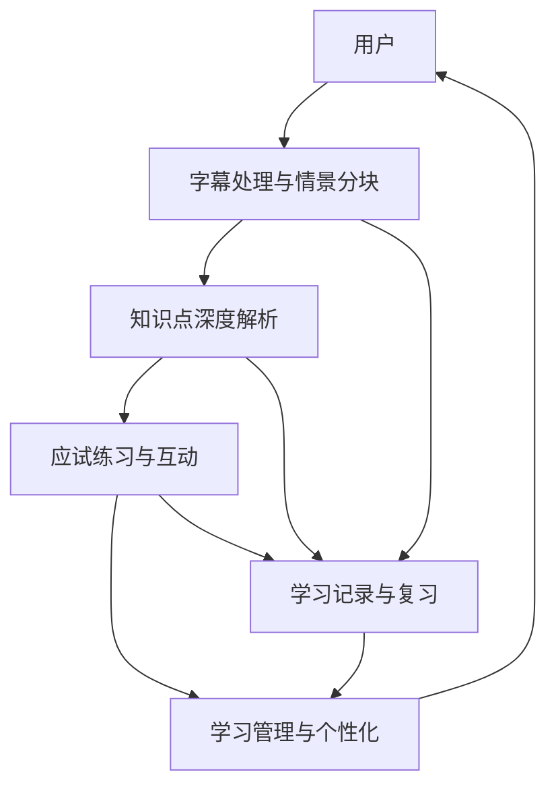
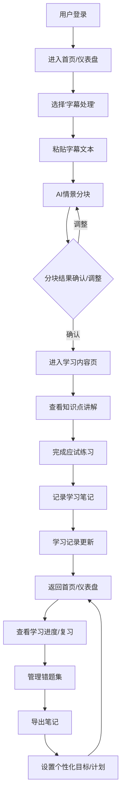
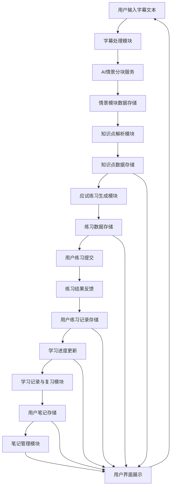

# 字幕智析产品需求文档

## 1. 产品概述

### 1.1 产品名称与定位

*   **产品名称:** 字幕智析
*   **产品定位:** 一款面向英语学习者和备考者的Web端智能语言学习平台，通过AI技术深度解析影视剧字幕，提供精细化的词汇、语法、发音、文化讲解及应试练习，帮助用户高效提升英语综合能力和应试技巧。

### 1.2 产品应用语言

*   **产品应用语言:** 简体中文

### 1.3 产品愿景与目标

*   **产品愿景:** 成为用户通过真实语境高效学习英语、攻克考试难关的首选智能助手。
*   **产品目标:**
    *   提升用户英语学习效率，解决知识点碎片化问题。
    *   增强用户对英语语境的理解能力，克服文化障碍。
    *   提供针对性的应试练习，帮助用户在各类英语考试中取得优异成绩。
    *   建立个性化学习路径，满足不同用户的学习需求。

### 1.4 产品使用终端

*   **主要终端:** Web端桌面应用
*   **浏览器支持:** Chrome 90+、Firefox 88+、Safari 14+、Edge 90+
*   **分辨率支持:** 768x480及以上分辨率，最佳体验为1920x1080
*   **响应式适配:** 支持768px以上的所有桌面和平板设备。

### 1.5 核心价值主张

*   **AI智能分块:** 自动将字幕文本按情景智能分块，确保学习内容的连贯性和针对性。
*   **深度多维度解析:** 针对每个情景模块，提供词汇、语法、发音、文化等多维度的专业讲解。
*   **考试导向:** 所有讲解和练习均紧密围绕主流英语考试（CET-4/6, IELTS, TOEFL, 考研英语），提升备考效率。
*   **个性化学习:** 支持学习进度跟踪、错题管理、自定义目标和学习计划推荐，实现因材施教。

### 1.6 目标用户群体分析

*   **英语考试备考者:** 主要为大学生、考研学生，以及计划参加雅思、托福等国际考试的用户。他们需要系统性、针对性的备考资料和练习，以应对考试中的词汇、语法、阅读和听力挑战。
*   **语言学习者:** 对英语学习有浓厚兴趣，希望通过真实语境（如影视剧）提升英语听说读写能力的用户。他们渴望深入理解语言背后的文化和语境。
*   **职场人士:** 希望提升职场英语沟通能力，或需要通过英语考试获得职业发展机会的用户。他们注重学习效率和实用性。
*   **大学生:** 作为英语学习的主要群体，他们既面临课程学习压力，也有备考四六级的需求，同时对新鲜、有趣的学习方式接受度高。

### 1.7 市场需求与竞品简析

*   **市场需求:**
    *   **碎片化学习需求:** 现代生活节奏快，用户需要能够利用碎片时间进行高效学习的工具。
    *   **个性化学习需求:** 传统教学模式难以满足个体差异，用户期待定制化的学习内容和路径。
    *   **真实语境学习需求:** 脱离语境的死记硬背效果不佳，用户希望在真实、生动的语言环境中学习。
    *   **应试痛点:** 考试内容多、范围广，用户需要高效、精准的备考资源和方法。
*   **竞品简析:**
    *   **传统词典/翻译工具:** 功能单一，缺乏语境和系统性学习。
    *   **在线课程平台:** 内容固定，互动性差，难以实现个性化。
    *   **其他AI学习工具:** 部分提供AI翻译或语法检查，但在多维度深度解析、情景分块和考试导向方面仍有提升空间。
*   **字幕智析优势:** 结合了AI智能分块、多维度深度解析、考试导向和个性化学习，填补了市场空白，为用户提供更全面、高效、有针对性的学习体验。

### 1.8 浏览器兼容性要求

*   **桌面浏览器:**
    *   Google Chrome (最新2个稳定版本)
    *   Mozilla Firefox (最新2个稳定版本)
    *   Microsoft Edge (最新2个稳定版本)
    *   Apple Safari (最新2个稳定版本)
*   **最低分辨率:** 1024x768px
*   **推荐分辨率:** 1920x1080px 及以上

## 2. 功能规格

### 2.1 功能详述

#### 2.1.1 字幕处理与情景分块

| 功能ID | 功能名称 | 功能描述 | 优先级 |
|--------|---------|---------|--------|
| F-SUBTITLE_001 | 文本粘贴输入 | 用户可直接将字幕文本粘贴到指定输入框中，系统自动识别并处理。 | P0 |
| F-SUBTITLE_002 | AI情景分块 | 系统根据AI算法自动将输入的字幕文本按照语义、场景、对话逻辑等进行智能分块，生成多个情景模块。 | P0 |
| F-SUBTITLE_003 | 分块结果展示 | 分块完成后，系统在界面上清晰展示每个情景模块的文本内容，用户可直观查看。 | P0 |
| F-SUBTITLE_004 | 分块控制与调整 | 用户可对AI生成的情景分块结果进行手动调整，包括合并、拆分、删除分块，以满足个性化学习需求。 | P1 |
| F-SUBTITLE_005 | 处理进度指示 | 在AI分块处理过程中，系统显示处理进度条或状态提示，告知用户当前处理状态。 | P1 |
| F-SUBTITLE_006 | 操作说明 | 提供简洁明了的操作指引，帮助用户快速上手字幕处理功能。 | P2 |

#### 2.1.2 知识点深度解析

| 功能ID | 功能名称 | 功能描述 | 优先级 |
|--------|---------|---------|--------|
| F-ANALYSIS_001 | 词汇分级讲解 | 针对每个情景模块，AI自动识别并讲解核心考试词汇（CET-4/6, IELTS, TOEFL, 考研英语），提供音标、词性、释义、考试标签、语境例句和考试风格例句。同时讲解必备短语与固定搭配，并提供认知拓展词汇。 | P0 |
| F-ANALYSIS_002 | 语法结构分析 | 对情景模块中的复杂句子进行结构图解，分析主干、从句等。重点讲解一个考试常考的语法点，并说明其在写作/口语中的应用。 | P0 |
| F-ANALYSIS_003 | 发音连读指导 | 标注核心考试词汇的重音和音节，并分析句子中的连读、弱读、缩读等现象，提供音标或直观标注。 | P0 |
| F-ANALYSIS_004 | 文化语境解读 | 解释字幕中出现的俚语、缩略语，分析其文化背景、社会背景以及句子的言外之意（如讽刺、委婉、强调）。 | P0 |

#### 2.1.3 应试练习与互动

| 功能ID | 功能名称 | 功能描述 | 优先级 |
|--------|---------|---------|--------|
| F-PRACTICE_001 | 理解检查 | 针对讲解的核心考试词汇和语法点，AI自动生成1-2个选择题或填空题，供用户进行理解检查。 | P0 |
| F-PRACTICE_002 | 仿写与替换 | 提供源自字幕的“黄金句型”，引导用户用新学的考试词汇进行替换练习，巩固句型应用能力。 | P0 |
| F-PRACTICE_003 | 拓展问题 | 提出一个与字幕主题相关的、雅思/托福口语风格的开放性问题，引导用户进行观点表达和口语练习。 | P1 |
| F-PRACTICE_004 | 练习反馈 | 用户完成练习后，系统立即给出正确答案和解析，并记录错题。 | P0 |

#### 2.1.4 学习管理与个性化

| 功能ID | 功能名称 | 功能描述 | 优先级 |
|--------|---------|---------|--------|
| F-LEARNING_001 | 学习进度跟踪 | 系统自动记录用户学习过的字幕、情景模块、知识点掌握情况和练习完成度，并在仪表盘上可视化展示。 | P0 |
| F-LEARNING_002 | 错题集管理 | 自动收集用户在练习中答错的题目，形成错题集，方便用户回顾和针对性复习。 | P0 |
| F-LEARNING_003 | 自定义学习目标 | 用户可根据自身需求设定学习目标，如“每日学习3个情景模块”、“CET-6词汇量提升500”等。 | P1 |
| F-LEARNING_004 | 学习计划推荐 | 基于用户的学习目标、进度和薄弱环节，系统智能推荐个性化学习计划。 | P1 |
| F-LEARNING_005 | 笔记管理 | 用户可在学习内容页对每个情景模块或知识点添加、编辑、查看和管理个人笔记。 | P0 |
| F-LEARNING_006 | 笔记导出 | 支持用户将个人笔记导出为常见格式（如TXT、PDF），方便离线复习或分享。 | P1 |

### 2.2 功能模块间的关系图

## 3. 用户流程

### 3.1 用户旅程地图

| 阶段 | 用户目标 | 用户行为 | 系统响应 | 痛点/机遇 |
|------|----------|----------|----------|-----------|
| **1. 输入字幕** | 获取学习材料 | 粘贴字幕文本 | 接收文本，显示处理进度 | 输入不便/格式限制 |
| **2. 情景分块** | 理解内容结构 | 查看AI分块结果，手动调整 | 展示分块，支持编辑 | 分块不准确/调整复杂 |
| **3. 深度学习** | 掌握知识点 | 阅读词汇、语法、发音、文化讲解 | 展示多维度解析内容 | 讲解不清晰/内容枯燥 |
| **4. 巩固练习** | 检验学习效果 | 完成理解检查、仿写、拓展问题 | 提供练习，即时反馈 | 练习形式单一/反馈不及时 |
| **5. 管理复习** | 跟踪进度，巩固薄弱 | 查看学习记录，复习错题，管理笔记 | 展示学习数据，提供复习工具 | 复习效率低/缺乏系统性 |
| **6. 个性化设置** | 优化学习体验 | 设置目标，查看推荐计划 | 提供个性化功能 | 目标不明确/计划不合理 |

### 3.2 关键业务流程图

### 3.3 各场景下的用户操作步骤

#### 3.3.1 场景一：首次使用与字幕处理

1.  **用户操作:** 打开浏览器，输入产品URL，进入登录页（P-LOGIN）。
2.  **用户操作:** 输入账号密码，点击“登录”按钮。
3.  **系统响应:** 验证成功后，跳转至首页/仪表盘（P-HOME）。
4.  **用户操作:** 在首页/仪表盘（P-HOME）点击左侧菜单“字幕处理”或主内容区的“开始处理字幕”按钮。
5.  **系统响应:** 跳转至字幕处理页（P-SUBTITLE_PROCESS）。
6.  **用户操作:** 在文本输入区粘贴字幕文本，点击“开始分块”按钮。
7.  **系统响应:** 显示处理进度指示，AI进行情景分块，完成后在分块结果展示区显示分块列表。
8.  **用户操作:** 查看分块结果，如需调整，使用分块控制工具栏进行合并、拆分或删除操作。
9.  **用户操作:** 确认分块无误后，点击“进入学习”按钮。
10. **系统响应:** 跳转至学习内容页（P-LEARNING_CONTENT），并加载第一个情景模块的详细解析。

#### 3.3.2 场景二：学习内容查看与练习

1.  **用户操作:** 在学习内容页（P-LEARNING_CONTENT），通过情景分块导航选择要学习的模块。
2.  **系统响应:** 主内容区显示该模块的字幕原文、词汇讲解、语法分析、发音指导和文化解读。
3.  **用户操作:** 阅读并学习各模块的知识点。
4.  **用户操作:** 在笔记编辑区输入个人笔记，点击“保存笔记”按钮。
5.  **系统响应:** 笔记保存成功，提示用户。
6.  **用户操作:** 点击“开始练习”按钮。
7.  **系统响应:** 页面切换至练习页面（P-PRACTICE），显示理解检查、仿写与替换、拓展问题。
8.  **用户操作:** 完成所有练习，点击“提交”按钮。
9.  **系统响应:** 立即显示练习结果和解析，并将错题记录到错题集。
10. **用户操作:** 点击“返回学习内容”按钮。
11. **系统响应:** 返回学习内容页（P-LEARNING_CONTENT）。

#### 3.3.3 场景三：学习记录与复习

1.  **用户操作:** 在首页/仪表盘（P-HOME）点击左侧菜单“学习记录”。
2.  **系统响应:** 跳转至学习记录页（P-LEARNING_RECORD），显示学习进度、历史学习内容列表。
3.  **用户操作:** 点击“错题集”标签页。
4.  **系统响应:** 显示错题列表，用户可筛选、查看错题详情。
5.  **用户操作:** 点击“笔记管理”标签页。
6.  **系统响应:** 显示个人笔记列表，用户可搜索、编辑、导出笔记。
7.  **用户操作:** 点击“复习计划”标签页。
8.  **系统响应:** 显示系统推荐的学习计划和用户自定义的学习目标。

## 4. 数据流设计

### 4.1 数据结构与关系

*   **用户 (User):**
    *   `UserID` (PK)
    *   `Username`
    *   `PasswordHash`
    *   `Email`
    *   `RegistrationDate`
    *   `LastLoginDate`
    *   `LearningGoals` (JSON/Text)
*   **字幕 (Subtitle):**
    *   `SubtitleID` (PK)
    *   `UserID` (FK)
    *   `OriginalText` (完整字幕文本)
    *   `UploadDate`
    *   `Status` (处理中/已完成)
*   **情景模块 (ScenarioBlock):**
    *   `BlockID` (PK)
    *   `SubtitleID` (FK)
    *   `BlockText` (模块文本内容)
    *   `OrderIndex` (模块在字幕中的顺序)
    *   `ProcessingStatus` (待处理/已处理)
*   **知识点 (KnowledgePoint):**
    *   `KnowledgeID` (PK)
    *   `BlockID` (FK)
    *   `Type` (词汇/语法/发音/文化)
    *   `Content` (具体讲解内容，JSON/Text)
    *   `ExamTags` (考试标签，如CET-4, IELTS)
*   **练习 (Practice):**
    *   `PracticeID` (PK)
    *   `BlockID` (FK)
    *   `KnowledgeID` (FK, 关联到对应的知识点)
    *   `Question` (问题内容)
    *   `Options` (选项，JSON/Text)
    *   `Answer` (正确答案)
    *   `Explanation` (解析)
    *   `Type` (理解检查/仿写/拓展问题)
*   **用户练习记录 (UserPracticeRecord):**
    *   `RecordID` (PK)
    *   `UserID` (FK)
    *   `PracticeID` (FK)
    *   `UserAnswer`
    *   `IsCorrect`
    *   `AttemptDate`
*   **用户笔记 (UserNote):**
    *   `NoteID` (PK)
    *   `UserID` (FK)
    *   `BlockID` (FK, 可选，可关联到特定模块)
    *   `KnowledgeID` (FK, 可选，可关联到特定知识点)
    *   `NoteContent`
    *   `CreateDate`
    *   `LastModifiedDate`
*   **学习进度 (LearningProgress):**
    *   `ProgressID` (PK)
    *   `UserID` (FK)
    *   `BlockID` (FK)
    *   `Status` (未开始/进行中/已完成)
    *   `LastAccessDate`
    *   `Score` (该模块练习得分)

### 4.2 关键数据流向图

### 4.3 数据存储与处理原则

1.  **数据安全性:**
    *   用户密码采用加盐哈希存储，确保不可逆。
    *   所有敏感数据传输采用HTTPS加密。
    *   定期进行数据备份和灾难恢复演练。
    *   严格的权限控制，确保只有授权用户和系统服务能访问相应数据。
2.  **数据一致性:**
    *   采用事务管理，确保数据操作的原子性、一致性、隔离性和持久性。
    *   关键业务数据（如学习进度、练习记录）实时更新，保证用户看到的是最新状态。
3.  **数据可扩展性:**
    *   数据库设计采用范式化原则，便于未来功能扩展和数据量增长。
    *   考虑使用分布式存储或云服务，应对高并发和大数据量存储需求。
4.  **数据处理效率:**
    *   对频繁查询的数据建立索引，优化查询性能。
    *   AI处理服务采用异步处理机制，避免阻塞用户操作。
    *   缓存常用数据，减少数据库访问压力。
5.  **数据隐私保护:**
    *   严格遵守数据隐私相关法律法规（如GDPR、国内网络安全法）。
    *   明确告知用户数据收集、使用目的，并获得用户授权。
    *   匿名化处理用户行为数据，用于产品优化和AI模型训练。

## 5. 页面规格

### 5.1 页面概览

#### 5.1.1 整体布局架构

*   **布局模式:** Web端响应式布局 - 固定顶部导航栏 + 左侧菜单 + 主内容区。
*   **空间分配策略:**
    *   顶部导航栏：固定高度60px，包含Logo、主要导航、用户操作区。
    *   左侧菜单：固定宽度200px（展开状态），48px（折叠状态），用于功能模块导航。
    *   主内容区：动态宽度，占据剩余空间，最小宽度720px。
    *   右侧面板：**严格限制使用**，仅在屏幕宽度≥1440px且功能确实必要时使用，宽度280-320px，必须在布局中占据独立空间，绝对不能遮挡主内容区，且需确保主内容区宽度≥720px。
*   **导航体系:** 顶部主导航（用户相关操作）+ 左侧功能菜单（核心功能模块）+ 面包屑导航（多层级页面）。
*   **交互模式:** 页面切换（通过左侧菜单或导航）、模态弹窗（表单提交、确认操作）、侧边抽屉（详情查看）、右键菜单（快捷操作）。

#### 5.1.2 页面列表

| 页面ID | 页面名称 | 核心功能 | 布局类型 | 右侧面板 |
|--------|---------|---------|---------|---------|
| P-LOGIN | 登录页 | 用户登录 | 单栏居中 | 不使用 |
| P-HOME | 首页/仪表盘 | 学习概览、快速入口、进度展示 | 二栏布局 | 慎用(仅在≥1440px且必要时) |
| P-SUBTITLE_PROCESS | 字幕处理页 | 字幕文本输入、AI分块、分块调整 | 二栏布局 | 不使用 |
| P-LEARNING_CONTENT | 学习内容页 | 知识点讲解、笔记编辑、情景导航 | 二栏布局 | 慎用(仅在≥1440px且必要时) |
| P-PRACTICE | 练习页面 | 理解检查、仿写、拓展问题、练习反馈 | 二栏布局 | 不使用 |
| P-NOTE_MANAGE | 笔记管理页 | 笔记列表、搜索、编辑、导出 | 二栏布局 | 不使用 |
| P-LEARNING_RECORD | 学习记录页 | 学习进度、错题集、学习计划 | 二栏布局 | 不使用 |
| P-SETTINGS | 个人设置页 | 账户信息、学习目标、通知偏好 | 二栏布局 | 不使用 |
| P-AIAPI_CONFIG | AI API配置页 | API密钥管理、服务提供商选择、参数配置 | 二栏布局 | 不使用 |

### 5.2 页面详情

#### 5.2.1 登录页（P-LOGIN）

**布局架构设计：**
- 页面类型：功能型页面，用户身份验证入口。
- 布局模式：单栏居中布局，简洁明了。
- 空间分配：登录表单区域居中显示，背景为产品品牌元素或简洁背景。

**页面布局架构：**
- 顶部导航栏：无。
- 左侧菜单：无。
- 主内容区域：
  - 登录表单：包含用户名/邮箱输入框、密码输入框、登录按钮、忘记密码链接、注册链接。
  - 品牌Logo和产品名称。
- 右侧面板：无。

**响应式适配策略：**
- 大屏幕(≥1440px)：登录表单区域固定宽度（如400px），居中显示。
- 中屏幕(1200-1439px)：登录表单区域固定宽度，居中显示。
- 小屏幕(768-1199px)：登录表单区域宽度自适应，最大宽度限制，居中显示。
- 移动端(<768px)：登录表单区域宽度100%充满，上下边距保留，确保输入区域可点击。

**组件尺寸规范：**
- 按钮尺寸：登录按钮高度40px，宽度100%。
- 输入框：高度40px，宽度100%。
- 间距规范：输入框间距16px，按钮与输入框间距24px。

**核心功能：**
用户身份验证、登录。

#### 5.2.2 首页/仪表盘（P-HOME）

**布局架构设计：**
- 页面类型：概览型页面，提供学习状态总览和核心功能入口。
- 布局模式：二栏布局，左侧菜单+主内容区。
- 空间分配：顶部导航栏固定，左侧菜单固定，主内容区动态填充剩余空间。

**页面布局架构：**
- 顶部导航栏：Logo、全局搜索框、消息通知、用户头像/下拉菜单 - 建议高度60px，固定定位。
- 左侧菜单：功能导航菜单（首页、字幕处理、学习记录、笔记管理、个人设置），当前选中“首页”，支持折叠 - 建议宽度200px(展开)/48px(折叠)。
- 主内容区域：核心展示区域，建议最小宽度720px。
  - 页面头部：欢迎信息、面包屑导航（首页） - 建议高度48px。
  - 学习进度概览：卡片式展示总学习时长、已完成模块数、掌握知识点数等关键指标。
  - 快速入口区：卡片或按钮组，提供“开始处理字幕”、“继续上次学习”、“查看错题集”等快捷操作。
  - 推荐学习内容：根据用户学习历史和目标，推荐相关字幕或情景模块。
  - 学习计划概览：显示当前学习计划的进度和下一步任务。
- 右侧面板：**慎用**：仅在屏幕宽度≥1440px且功能确实必要时使用，辅助功能区域，宽度280-320px（**严格要求：在布局中占据独立空间，绝对不能遮挡主内容，且需确保主内容区宽度≥720px**）。
  - 推荐内容：热门学习资源、最新功能介绍。
  - 学习小贴士：每日一句、学习技巧等。

**响应式适配策略：**
- 大屏幕(≥1440px)：二栏布局，左侧200px + 主内容区(≥720px) + 右侧280-320px（**所有面板均占据布局空间，严禁遮挡**）。
- 中屏幕(1200-1439px)：二栏布局，**严禁使用右侧面板**，主内容区充满剩余空间。
- 小屏幕(768-1199px)：左侧菜单折叠或抽屉式，主内容区卡片布局改为2列或1列（**抽屉式菜单需用户主动触发**）。
- 移动端(<768px)：单栏布局，左侧菜单隐藏（通过顶部按钮触发抽屉），内容单列显示，保持核心功能（**所有侧边面板均隐藏或抽屉化**）。

**组件尺寸规范：**
- 按钮尺寸：主要操作按钮36px高度，次要按钮32px高度。
- 输入框：全局搜索框36px高度。
- 统计卡片：建议最小高度120px，宽度自适应，最小200px。
- 间距规范：卡片间距16px，区域间距20px，组件内间距12px。

**核心功能：**
学习进度可视化、快速功能入口、个性化内容推荐、学习计划概览。

#### 5.2.3 字幕处理页（P-SUBTITLE_PROCESS）

**布局架构设计：**
- 页面类型：功能型页面，用于用户输入字幕并进行AI分块处理。
- 布局模式：二栏布局，左侧菜单+主内容区。
- 空间分配：顶部导航栏固定，左侧菜单固定，主内容区动态填充剩余空间。

**页面布局架构：**
- 顶部导航栏：同首页/仪表盘（P-HOME）。
- 左侧菜单：同首页/仪表盘（P-HOME），当前选中“字幕处理”。
- 主内容区域：核心功能区域，建议最小宽度720px。
  - 页面头部：页面标题“字幕处理”、面包屑导航（首页 > 字幕处理） - 建议高度48px。
  - 文本输入区：大尺寸文本输入框，支持多行文本粘贴，下方有“开始分块”按钮。
  - 分块结果展示区：AI分块完成后，以列表或卡片形式展示每个情景模块的文本内容，可点击查看详情。
  - 分块控制工具栏：提供“合并”、“拆分”、“删除”、“上移”、“下移”等按钮，用于调整分块。
  - 处理进度指示区：在AI分块处理过程中显示进度条或状态提示。
  - 操作说明区：简洁的文字说明，指导用户如何使用该功能。
- 右侧面板：无。

**响应式适配策略：**
- 大屏幕(≥1440px)：二栏布局，左侧200px + 主内容区(≥720px)。
- 中屏幕(1200-1439px)：二栏布局，主内容区充满剩余空间。
- 小屏幕(768-1199px)：左侧菜单折叠或抽屉式，文本输入区和分块结果区垂直排列。
- 移动端(<768px)：单栏布局，左侧菜单隐藏，文本输入区和分块结果区垂直排列。

**组件尺寸规范：**
- 按钮尺寸：开始分块按钮高度40px，分块控制按钮高度32px。
- 输入框：文本输入框高度自适应，最小高度150px。
- 分块卡片：建议最小高度80px，宽度自适应。
- 间距规范：区域间距24px，组件间距16px。

**核心功能：**
字幕文本粘贴输入、AI情景分块、分块结果展示、分块控制与调整、处理进度指示、操作说明。

#### 5.2.4 学习内容页（P-LEARNING_CONTENT）

**布局架构设计：**
- 页面类型：内容展示型页面，用于详细展示知识点讲解和笔记编辑。
- 布局模式：二栏布局，左侧菜单+主内容区。
- 空间分配：顶部导航栏固定，左侧菜单固定，主内容区动态填充剩余空间。

**页面布局架构：**
- 顶部导航栏：同首页/仪表盘（P-HOME）。
- 左侧菜单：同首页/仪表盘（P-HOME），当前选中“学习记录”或“字幕处理”（根据来源）。
- 主内容区域：核心学习内容展示区域，建议最小宽度720px。
  - 页面头部：页面标题“学习内容”、面包屑导航（首页 > 学习记录 > 学习内容） - 建议高度48px。
  - 情景分块导航：左侧小型二级菜单或顶部标签页，列出当前字幕的所有情景模块，点击可切换学习内容。
  - 字幕原文展示：当前情景模块的完整字幕文本。
  - 词汇讲解区：分级词汇（核心考试词汇、必备短语、认知拓展词汇）的详细讲解。
  - 语法分析区：句子结构图解、重点语法点讲解、写作/口语应用。
  - 发音指导区：核心词汇发音、地道连读与音变分析。
  - 文化解读区：俚语与口语解释、文化背景与语用功能分析。
  - 笔记编辑区：文本输入框，用户可在此添加、编辑与当前模块相关的个人笔记，下方有“保存笔记”按钮。
  - “开始练习”按钮：位于页面底部或侧边，引导用户进入练习。
- 右侧面板：**慎用**：仅在屏幕宽度≥1440px且功能确实必要时使用，辅助功能区域，宽度280-320px（**严格要求：在布局中占据独立空间，绝对不能遮挡主内容，且需确保主内容区宽度≥720px**）。
  - 相关知识点推荐：根据当前学习内容推荐其他相关知识点。
  - 学习工具：如词典查询入口、发音播放器等。

**响应式适配策略：**
- 大屏幕(≥1440px)：二栏布局，左侧200px + 主内容区(≥720px) + 右侧280-320px（**所有面板均占据布局空间，严禁遮挡**）。
- 中屏幕(1200-1439px)：二栏布局，**严禁使用右侧面板**，主内容区充满剩余空间。
- 小屏幕(768-1199px)：左侧菜单折叠或抽屉式，情景分块导航改为顶部标签页或下拉菜单，各知识点模块垂直堆叠。
- 移动端(<768px)：单栏布局，左侧菜单隐藏，各知识点模块垂直堆叠，保持核心功能。

**组件尺寸规范：**
- 按钮尺寸：保存笔记按钮高度36px，开始练习按钮高度40px。
- 输入框：笔记编辑区高度自适应，最小高度100px。
- 间距规范：知识点模块间距24px，组件间距16px。

**核心功能：**
字幕原文展示、情景分块导航、词汇分级讲解、语法结构分析、发音连读指导、文化语境解读、笔记编辑与保存、进入练习。

#### 5.2.5 练习页面（P-PRACTICE）

**布局架构设计：**
- 页面类型：功能型页面，用于用户进行应试练习并获取反馈。
- 布局模式：二栏布局，左侧菜单+主内容区。
- 空间分配：顶部导航栏固定，左侧菜单固定，主内容区动态填充剩余空间。

**页面布局架构：**
- 顶部导航栏：同首页/仪表盘（P-HOME）。
- 左侧菜单：同首页/仪表盘（P-HOME），当前选中“学习记录”或“学习内容”（根据来源）。
- 主内容区域：核心练习区域，建议最小宽度720px。
  - 页面头部：页面标题“应试练习”、面包屑导航（首页 > 学习内容 > 应试练习） - 建议高度48px。
  - 练习题目区：
    - 理解检查：选择题或填空题，显示题目、选项、用户输入框。
    - 仿写与替换：显示黄金句型，提供用户输入框进行替换练习。
    - 拓展问题：显示开放性问题，提供大文本输入框供用户回答。
  - 提交按钮：位于练习题目下方，用于提交练习答案。
  - 练习结果反馈区：提交后显示，包含正确答案、用户答案、解析、错题标记。
  - “返回学习内容”按钮：位于结果反馈区下方。
- 右侧面板：无。

**响应式适配策略：**
- 大屏幕(≥1440px)：二栏布局，左侧200px + 主内容区(≥720px)。
- 中屏幕(1200-1439px)：二栏布局，主内容区充满剩余空间。
- 小屏幕(768-1199px)：左侧菜单折叠或抽屉式，练习题目垂直排列。
- 移动端(<768px)：单栏布局，左侧菜单隐藏，练习题目垂直排列。

**组件尺寸规范：**
- 按钮尺寸：提交按钮高度40px，返回按钮高度36px。
- 输入框：理解检查输入框高度36px，仿写与替换输入框高度40px，拓展问题输入框高度100px。
- 间距规范：题目间距24px，选项间距12px。

**核心功能：**
理解检查、仿写与替换、拓展问题、练习反馈。

#### 5.2.6 笔记管理页（P-NOTE_MANAGE）

**布局架构设计：**
- 页面类型：管理型页面，用于用户查看、编辑和导出个人笔记。
- 布局模式：二栏布局，左侧菜单+主内容区。
- 空间分配：顶部导航栏固定，左侧菜单固定，主内容区动态填充剩余空间。

**页面布局架构：**
- 顶部导航栏：同首页/仪表盘（P-HOME）。
- 左侧菜单：同首页/仪表盘（P-HOME），当前选中“笔记管理”。
- 主内容区域：核心笔记管理区域，建议最小宽度720px。
  - 页面头部：页面标题“笔记管理”、面包屑导航（首页 > 笔记管理） - 建议高度48px。
  - 工具栏区域：搜索框、筛选条件（按模块、按知识点、按时间）、“导出笔记”按钮。
  - 笔记列表：以表格形式展示所有笔记，包含笔记标题/摘要、关联模块、创建时间、最后修改时间、操作（编辑、删除）。
  - 分页区域：分页控件，显示总笔记数、每页条数选择。
- 右侧面板：无。

**响应式适配策略：**
- 大屏幕(≥1440px)：二栏布局，左侧200px + 主内容区(≥720px)。
- 中屏幕(1200-1439px)：二栏布局，主内容区充满剩余空间。
- 小屏幕(768-1199px)：左侧菜单折叠或抽屉式，笔记列表可简化显示或支持横向滚动。
- 移动端(<768px)：单栏布局，左侧菜单隐藏，笔记列表简化为卡片式或仅显示关键信息。

**组件尺寸规范：**
- 按钮尺寸：导出笔记按钮高度36px，编辑/删除按钮高度28px。
- 输入框：搜索框高度36px。
- 表格行高：建议36px。
- 间距规范：工具栏与列表间距16px，列表行间距8px。

**核心功能：**
笔记列表展示、笔记搜索与筛选、笔记编辑、笔记删除、笔记导出。

**数据结构：**
| 列名 | 数据类型 | 宽度建议 | 是否可排序 | 操作功能 |
|------|---------|----------|----------|---------|
| 笔记标题/摘要 | 文本 | 300px | 是 | 点击查看详情/编辑 |
| 关联模块 | 文本 | 150px | 是 | 点击跳转学习内容 |
| 创建时间 | 日期时间 | 120px | 是 | 无 |
| 最后修改时间 | 日期时间 | 120px | 是 | 无 |
| 操作 | 操作按钮组 | 100px | 否 | 编辑/删除 |

#### 5.2.7 学习记录页（P-LEARNING_RECORD）

**布局架构设计：**
- 页面类型：概览型页面，用于用户查看学习进度、错题集和学习计划。
- 布局模式：二栏布局，左侧菜单+主内容区。
- 空间分配：顶部导航栏固定，左侧菜单固定，主内容区动态填充剩余空间。

**页面布局架构：**
- 顶部导航栏：同首页/仪表盘（P-HOME）。
- 左侧菜单：同首页/仪表盘（P-HOME），当前选中“学习记录”。
- 主内容区域：核心学习记录区域，建议最小宽度720px。
  - 页面头部：页面标题“学习记录”、面包屑导航（首页 > 学习记录） - 建议高度48px。
  - 标签页导航：包含“学习进度”、“错题集”、“学习计划”三个标签页。
  - **学习进度标签页：**
    - 学习概览图表：如学习时长趋势图、模块完成率饼图。
    - 历史学习列表：表格形式展示已学习的字幕和情景模块，包含模块名称、学习日期、掌握程度、操作（复习）。
  - **错题集标签页：**
    - 错题列表：表格形式展示所有错题，包含题目、所属知识点、错误次数、操作（查看详情、再次练习）。
    - 错题筛选：按知识点、按考试类型、按时间筛选。
  - **学习计划标签页：**
    - 自定义学习目标展示与编辑。
    - 系统推荐学习计划展示。
    - 计划进度条。
- 右侧面板：无。

**响应式适配策略：**
- 大屏幕(≥1440px)：二栏布局，左侧200px + 主内容区(≥720px)。
- 中屏幕(1200-1439px)：二栏布局，主内容区充满剩余空间。
- 小屏幕(768-1199px)：左侧菜单折叠或抽屉式，标签页内容垂直排列，表格可简化或支持横向滚动。
- 移动端(<768px)：单栏布局，左侧菜单隐藏，标签页内容垂直排列，表格简化为卡片式。

**组件尺寸规范：**
- 按钮尺寸：复习按钮高度32px，编辑目标按钮高度36px。
- 表格行高：建议36px。
- 间距规范：标签页内容间距24px。

**核心功能：**
学习进度可视化、历史学习列表、错题集管理、错题筛选、自定义学习目标、学习计划推荐。

**数据结构：**(学习进度列表)
| 列名 | 数据类型 | 宽度建议 | 是否可排序 | 操作功能 |
|------|---------|----------|----------|---------|
| 模块名称 | 文本 | 250px | 是 | 点击跳转学习内容 |
| 学习日期 | 日期时间 | 120px | 是 | 无 |
| 掌握程度 | 百分比/星级 | 100px | 是 | 无 |
| 操作 | 操作按钮 | 80px | 否 | 复习 |

**数据结构：**(错题集列表)
| 列名 | 数据类型 | 宽度建议 | 是否可排序 | 操作功能 |
|------|---------|----------|----------|---------|
| 题目 | 文本 | 400px | 否 | 点击查看详情 |
| 所属知识点 | 文本 | 150px | 是 | 无 |
| 错误次数 | 数字 | 80px | 是 | 无 |
| 操作 | 操作按钮组 | 120px | 否 | 查看详情/再次练习 |

#### 5.2.8 个人设置页（P-SETTINGS）

**布局架构设计：**
- 页面类型：功能型页面，用于用户管理个人账户信息和个性化设置。
- 布局模式：二栏布局，左侧菜单+主内容区。
- 空间分配：顶部导航栏固定，左侧菜单固定，主内容区动态填充剩余空间。

**页面布局架构：**
- 顶部导航栏：同首页/仪表盘（P-HOME）。
- 左侧菜单：同首页/仪表盘（P-HOME），当前选中“个人设置”。
- 主内容区域：核心设置区域，建议最小宽度720px。
  - 页面头部：页面标题“个人设置”、面包屑导航（首页 > 个人设置） - 建议高度48px。
  - 左侧小型二级菜单：包含“基本资料”、“账号安全”、“通知偏好”、“学习目标”等子项。
  - **基本资料：** 用户名、邮箱、头像上传、个人简介编辑。
  - **账号安全：** 修改密码、绑定手机/邮箱。
  - **通知偏好：** 学习提醒、系统通知开关。
  - **学习目标：** 查看和编辑自定义学习目标。
  - **AI API配置：** 管理AI服务提供商、API密钥和调用参数。
- 右侧面板：无。

**响应式适配策略：**
- 大屏幕(≥1440px)：二栏布局，左侧200px + 主内容区(≥720px)。
- 中屏幕(1200-1439px)：二栏布局，主内容区充满剩余空间。
- 小屏幕(768-1199px)：左侧菜单折叠或抽屉式，二级菜单改为顶部标签页或下拉菜单。
- 移动端(<768px)：单栏布局，左侧菜单隐藏，二级菜单改为顶部标签页或下拉菜单。

**组件尺寸规范：**
- 按钮尺寸：保存按钮高度36px。
- 输入框：高度36px。
- 间距规范：表单项间距16px。

**核心功能：**
基本资料管理、账号安全设置、通知偏好设置、学习目标管理、AI API配置。

